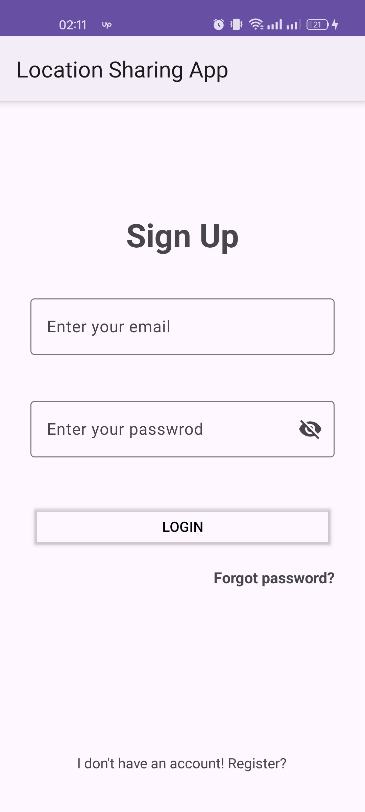
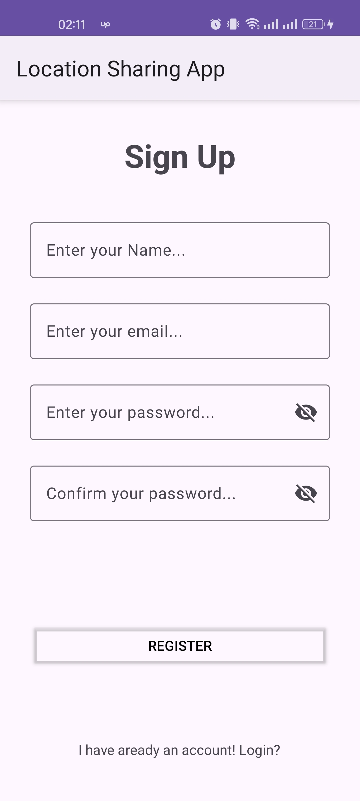
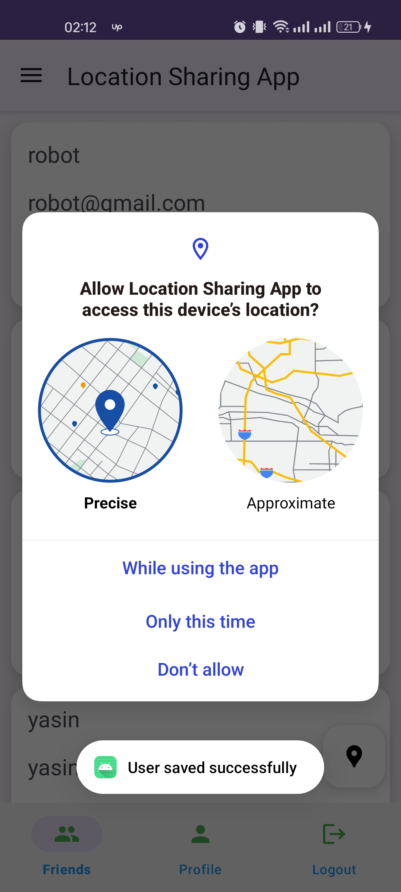
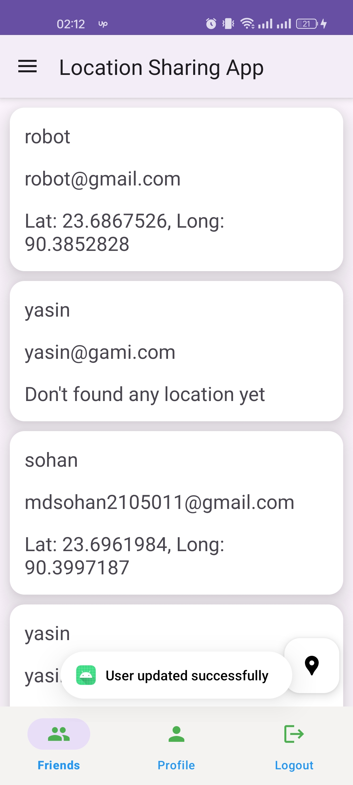
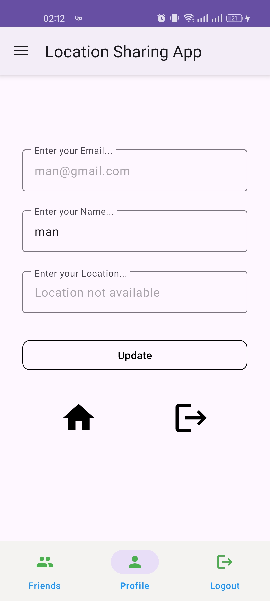
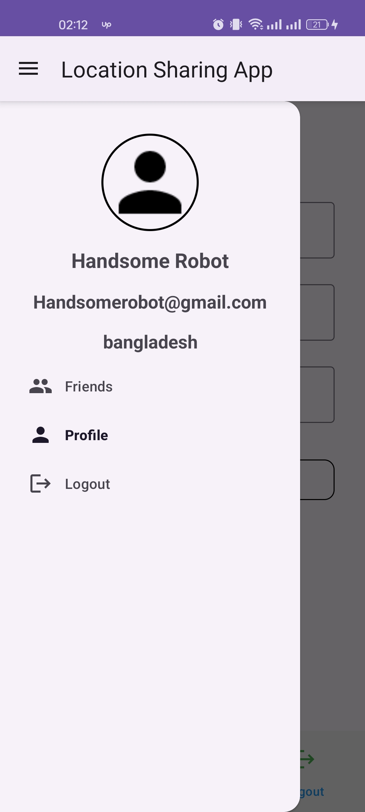
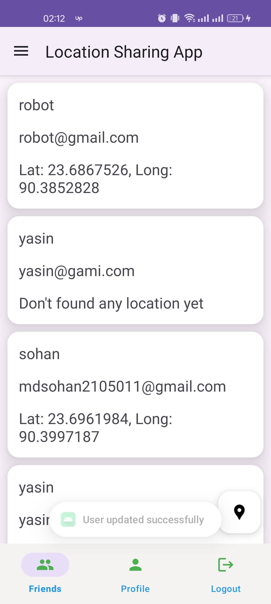
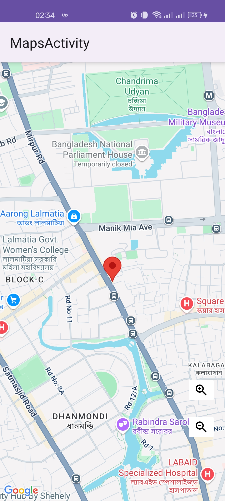

# 📍 Location Sharing App

A simple Android app to share and view users’ real-time locations on Google Maps. Built with Kotlin, MVVM, Firebase Firestore, and Google Maps SDK.

## ✨ Features
- User authentication with Firebase
- Store & fetch real-time locations from Firestore
- Display users on Google Maps with markers
- Safe parsing of location strings to avoid crashes

## 🚀 Screenshots

  
  
  
  
  
  
  
  

